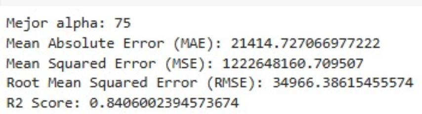

# Predicción de Precios de Bienes Raices en Australia - Regresión Avanzada


## Índice


- [Índice]
- [Introducción](#introducción)
  - [Métodos Utilizados](#métodos-utilizados)
  - [Tecnologías](#tecnologías)
- [Descarga y Configuración](#descarga-y-configuración)
  - [Requisitos Previos](#requisitos-previos)
  - [Cómo Ejecutar](#cómo-ejecutar)
- [Declaración del Problema](#declaración-del-problema)
  - [Objetivo Comercial](#objetivo-comercial)
  - [Preparación de Datos:](#preparación-de-datos)
  - [Construcción y Evaluación del Modelo](#construcción-y-evaluación-del-modelo)
  - [Conclusiones](#conclusiones)
    - [Regresión Ridge](#regresión-ridge)
    - [Regresión Lasso](#regresión-lasso)
    - [Regresión ElasticNet](#regresión-lasso)
    - [Las Variables Más Significativas Son:](#las-variables-más-significativas-son)


## Introducción


Surprise Housing, una empresa de bienes raices en EE.UU., planea expandirse al mercado australiano comprando propiedades a un precio inferior a su valor de mercado para luego venderlas a un precio mayor. Para lograr esto, la compañia utiliza modelos de regresion en su analisis de datos, identificando que variables son clave para predecir el precio de una propiedad y cuan bien estas variables representan el valor real. Este analisis permitira a Surprise Housing entender mejor la dinamica de precios en el mercado australiano y ajustar su estrategia de inversion en propiedades.


### Métodos Utilizados


* Regresion Ridge: Aplica una penalizacion cuadrada a los coeficientes para reducir el riesgo de sobreajuste y tratar problemas de multicolinealidad.


* Regresion Lasso: Aplica una penalizacion absoluta, util para realizar seleccion de caracteristicas, eliminando aquellas variables que no aportan significativamente al modelo.
* Regresion ElasticNet: Combina los metodos de penalizacion de Ridge y Lasso para obtener lo mejor de ambos.


### Tecnologías


* Python: Analisis de datos.
* Pandas y NumPy: Manipulacion de datos.
* Scikit-Learn: Construccion y evaluacion de modelos de regresion con regularizacion.
* Matplotlib y Seaborn: Visualizacion de datos y resultados.


## Descarga y Configuración


* Clona el repositorio o descarga el archivo CSV con los datos de venta de propiedades en Australia.
* Ejecuta el archivo de análisis en un entorno de Jupyter Notebook o IDE compatible con Python.
* Sigue los pasos en el notebook para cargar, preprocesar los datos y entrenar los modelos de regresión.


### Requisitos Previos


Este proyecto necesita que Anaconda esté instalado en la computadora.


Para más detalles sobre la instalación, visite: https://docs.anaconda.com/anaconda/install/index.html


### Cómo Ejecutar


Puede descargar el código fuente clonando este repositorio usando Git:


1. Abra su aplicación Terminal favorita (Unix, Linux o Macos), como Terminal, Comando, Consola, iTerm2, etc.


2. Clone el repositorio


```
git clone https://github.com/AlphaJack1/AlgoritmosDT-IB.git
```


3. Abra el archivo notebook **MDSv5_ML_P1_Regresion Avanzada.ipynb** en Anaconda.


```
jupyter notebook  MDSv5_ML_P1_Regresion Avanzada.ipynb
```


## Declaración del Problema


Predecir el precio de venta de viviendas, utilizando información sobre las propiedades que incluye diversas características estructurales, de ubicación, y otros factores descriptivos.


### Objetivo Comercial


El objetivo es mejorar la precisión en la estimación de precios de venta de viviendas, lo cual tiene varios beneficios comerciales:
1. Optimización de Valoración de Propiedades. Esto ayuda a evitar precios excesivos o insuficientes, aumentando la probabilidad de cerrar ventas a precios competitivos.
2. Mejor Estrategia de Ventas y Marketing. 
3. Asesoría y Consultoría a Clientes
4. Planeación de Proyectos de Construcción
5. Benchmarking y Comparación de Competencia


### Preparación de Datos:


1. Limpieza de Datos y Análisis de Datos Faltantes.
2. Análisis de Valores Atípicos.
3. Derivación de Columnas Categóricas.
4. Análisis Univariable.
5. Análisis Bivariable.
6. Análisis Multivariable.


### Construcción y Evaluación del Modelo


1. División de datos de entrenamiento y prueba.
2. Preparación del modelo usando OLS & Regresión Lineal.
3. Modelos de Regularización Ridge, Lasso y ElasticNet.
4. Análisis de Residuos.
5. Evaluación y Valoración del Modelo.
6. Predicción.
7. Conclusión y Análisis Final.


### Conclusiones


Para máxima precisión: Si el objetivo es obtener predicciones precisas sin preocuparse demasiado por la interpretabilidad, Random Forest es el mejor modelo, dado su alto R² Score y los menores errores.
Para balancear precisión e interpretabilidad: Si es importante mantener cierto nivel de interpretabilidad y un buen rendimiento, ElasticNet es una opción óptima.
Para simplicidad y fácil interpretabilidad: Si el enfoque está en la interpretación del modelo y en una regresión menos compleja, tanto Lasso como Ridge son adecuados, siendo Lasso útil para la selección de características.


### Conclusions


R2_Score for Ridge regresion

R2_Score for Lasso regresion

R2_Score for ElasticNet regresion


